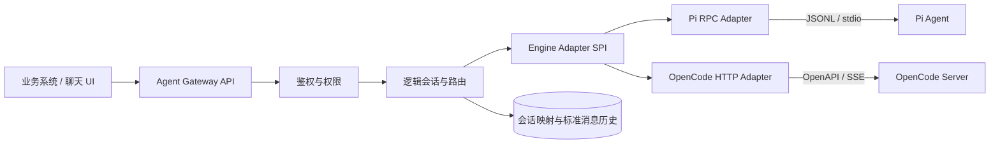

# Switchboard：可替换 Agent 引擎网关

这是一个面向 AI 争霸赛的可运行参考实现：业务系统只调用稳定的 Agent Gateway 接口，网关通过统一 Engine Adapter SPI 接入 **Pi Agent** 与 **OpenCode**。Pi 使用 JSONL/RPC 子进程协议，OpenCode 使用 HTTP/OpenAPI 与 SSE，会话、事件和错误在网关层被统一。

项目内置“评测接口对话控制台”。页面不再维护独立的演示消息，而是直接调用赛题规定的 `/session`、`/prompt_async`、`/message`、`/event`、`/question` 和 `/permission`：页面看到的 Session ID 和消息可被评测接口原样查询。

## 全新 Windows 沙箱启动

Windows 10/11 的全新沙箱只需要能够联网并带有系统自带的 Windows PowerShell，不要求预装 Node.js、Python、Pi 或 OpenCode，也不需要管理员权限：

```powershell
.\setup.cmd
Copy-Item .env.example .env
.\start.cmd
```

`setup.cmd` 将 Node.js `22.23.2`、Python `3.12.10`、Pi `0.84.4`、OpenCode `1.18.25` 和 Office 测试依赖安装到项目的 `.runtime/`。下载文件使用固定 SHA-256 校验；`.runtime/` 不提交 Git，也不修改系统 PATH。`start.cmd` 只在当前进程树中把这些私有工具设为默认值，因此 Pi、OpenCode 及其终端工具看到的是同一套 Node/Python 环境。

私有环境完整自检：

```powershell
.\test.cmd
```

真实测试集运行：

```powershell
.\test-data.cmd --engine pi
.\test-data.cmd --engine opencode
```

首次安装需要联网；后续启动无需重新下载。重复执行 `setup.cmd` 会复用校验通过的下载和已安装组件。

## 已有运行时快速启动

如果机器已经安装 Node.js `22.19.0` 或更高版本，可以继续使用：

```bash
npm start
```

打开 <http://localhost:6217/>。默认端口遵循赛题接口规范；`mock` 模式下 Pi 与 OpenCode 都能直接演示，不需要模型密钥。

也可以使用 Docker：

```bash
docker compose up --build
```

本交付件已在 Windows 上验证项目私有 Node `22.23.2`、Python `3.12.10`、OpenCode `1.18.25` 与 Pi `0.84.4`。模型通过请求和环境变量配置，正式评测使用赛事提供或允许的内部部署模型。比赛环境建议固定这些已验证版本，升级后重新执行协议测试。

## 演示路径

1. 使用 `npm start -- --engine pi` 启动，在页面左侧点击 `POST /session`；
2. 发送消息，观察 `busy → idle` 状态和 `message.part.updated` SSE；
3. 复制页面 Session ID，调用 `GET /session/{id}/message`，确认能查到页面中的同一组消息；
4. 使用 `npm start -- --engine opencode` 重启，再重复相同评测流程；
5. 将 `OPENCODE_PERMISSION_MODE=ask` 后测试工具操作，可在页面直接处理 `/permission` 权限申请和 `/question` 反问。

赛题规范要求在不同评测轮次通过启动参数切换引擎，而不是在同一网关进程中动态切换；页面会明确显示本次启动所用引擎。额外的 `/api/chat` 和会话级切换接口仍保留，供架构扩展测试使用。

命令行自动演示：

```bash
npm run demo
```

运行契约测试：

```bash
npm test
```

## 架构



稳定边界位于 `src/adapters/adapter.js`。新增引擎只需实现：

- `metadata()`：能力和传输信息；
- `healthCheck()`：健康状态；
- `createSession()`：创建原生引擎会话；
- `run()`：将原生流转换成统一事件；
- `closeSession()`：释放会话资源。

网关维护如下关系：

```text
tenantId + conversationId
          -> logicalSessionId
          -> activeEngine
          -> bindings.pi.engineSessionId
          -> bindings.opencode.engineSessionId
          -> normalized history
```

## 网关接口

赛题附件定义的接口已完整实现：`POST /session`、`GET/DELETE /session/:id`、`GET /session/status`、`POST /session/:id/prompt_async`、`GET /session/:id/message`、`POST /session/:id/abort|stop`、问题/权限交互接口以及 `GET /event` 全局 SSE。严格执行方式见 [INSTRUCTION.md](INSTRUCTION.md)。

启动参数及环境变量均可切换引擎：

```powershell
.\gateway.cmd --engine opencode --port 6217 --host localhost
$env:AGENT_ENGINE = "pi"; npm start
```

以下 `/api/*` 是额外的网页演示接口，不影响比赛评测：

| 方法 | 路径 | 作用 |
|---|---|---|
| `GET` | `/health` | 网关健康检查 |
| `GET` | `/api/engines` | 引擎能力与健康状态 |
| `POST` | `/api/chat` | 非流式统一聊天接口 |
| `POST` | `/api/chat/stream` | SSE 流式统一聊天接口 |
| `GET` | `/api/sessions/:conversationId` | 查询会话路由和绑定 |
| `POST` | `/api/sessions/:conversationId/switch` | 切换会话活动引擎 |
| `DELETE` | `/api/sessions/:conversationId` | 关闭并删除会话 |
| `POST` | `/v1/chat/completions` | OpenAI Chat Completions 兼容入口 |

示例：

```bash
curl -X POST http://localhost:6217/api/chat \
  -H "Content-Type: application/json" \
  -d '{"tenantId":"contest","conversationId":"group-a","engine":"pi","input":"你好"}'
```

切换引擎：

```bash
curl -X POST http://localhost:6217/api/sessions/group-a/switch \
  -H "Content-Type: application/json" \
  -d '{"tenantId":"contest","engine":"opencode"}'
```

## 连接真实引擎

复制配置：

```powershell
Copy-Item .env.example .env
```

将 `.env` 中的 `ENGINE_MODE` 改为 `real`。

### 本地 OpenAI 兼容模型（无需修改用户目录）

如果本地模型提供 `/v1/chat/completions`，只需在项目 `.env` 配置：

```dotenv
ENGINE_MODE=real
LOCAL_MODEL_BASE_URL=http://127.0.0.1:8017/v1
LOCAL_MODEL_PROVIDER_ID=local-8017
LOCAL_MODEL_ID=deepseek
LOCAL_MODEL_API_KEY=local
OPENCODE_AUTOSTART=true
OPENCODE_PERMISSION_MODE=allow
```

执行 `npm start` 后，网关会在被 `.gitignore` 排除的 `data/runtime/` 下自动生成 Pi 配置，并通过 `OPENCODE_CONFIG_CONTENT` 给自动启动的 OpenCode Server 注入同一 Provider。无需创建或编辑用户目录下的 `.pi`、`.config/opencode`。`PI_PROVIDER/PI_MODEL` 与 `OPENCODE_PROVIDER_ID/OPENCODE_MODEL_ID` 留空时自动继承统一配置。

标准鉴权默认发送 `Authorization: Bearer <LOCAL_MODEL_API_KEY>`。如果模型服务要求自定义请求头，例如 `Auth: token`，只需追加：

```dotenv
LOCAL_MODEL_AUTH_HEADER=Auth
# 留空时复用 LOCAL_MODEL_API_KEY；需要前缀时可填写完整值，例如 Bearer token
LOCAL_MODEL_AUTH_VALUE=
```

该 Header 会同时注入 Pi 和 OpenCode 的模型请求，不需要手工修改任何引擎配置文件。自定义 Header 启用后，两种引擎都不再额外生成标准 Authorization Header。

普通无人值守对话使用 `OPENCODE_PERMISSION_MODE=allow`；网关既会把该策略注入自己启动的 OpenCode Server，也会在连接外部 OpenCode 时自动处理意外到达的权限事件，因此这些请求不会进入网关 `/permission` 队列。验证权限流程时改为 `ask`，可通过 `/permission/{id}/reply` 回复。回复接口是幂等的，OpenCode 已处理的请求会从网关队列自动清除。

建议保持 `OPENCODE_AUTOSTART=true`，让网关在 OpenCode 评测轮次管理 Server 并确保配置一致。如果 4096 端口已有手工启动的旧 OpenCode，它不会重新读取网关 `.env`；应先停止旧进程再启动网关，或者设置 `OPENCODE_AUTOSTART=false` 明确使用外部 Server。

OpenCode 适配器使用上游 `/prompt_async` 加 SSE/状态轮询完成长任务，不再让 `/session/{id}/message` HTTP 请求一直挂起。网关默认任务超时为 10 分钟（`RUN_TIMEOUT_MS=600000`）；更长任务可以继续调大。

### 启动时加载共享 Skills

在 `.env` 指向一个共享 Skill 目录，网关启动时会将其同步到项目隔离的 Pi 和 OpenCode 运行目录，不会改动用户主目录：

```dotenv
AGENT_SKILLS_DIR=C:/agent-assets/skills
PI_AGENT_DIR=./data/runtime/pi-agent
OPENCODE_CONFIG_DIR=./data/runtime/opencode
OPENCODE_AUTOSTART=true
```

推荐一个目录放多个 Skill：

```text
C:/agent-assets/skills/
├── file-reader/
│   ├── SKILL.md
│   └── references/
│       ├── rules.md
│       └── examples.md
└── web-search/
    ├── SKILL.md
    └── references/
        └── policy.md
```

也支持 `AGENT_SKILLS_DIR` 直接指向单个 Skill 目录。如果入口文件不是 `SKILL.md`，该目录中必须只有一个非 `README.md` 的顶层 `.md` 文件；同步时会自动规范化为 `SKILL.md`。每个入口必须包含：

```markdown
---
name: file-reader
description: Read local files according to the supplied rules
---
```

`name` 必须是小写字母、数字和单连字符组成，并且全局唯一。整个 Skill 目录会递归复制，所以 `references/`、`scripts/` 和其他相对路径资源都会保留。启动成功时控制台会输出 `Loaded skills (N): ...`；配置或 frontmatter 无效时会直接阻止启动并给出具体文件。

同步目标是 `data/runtime/pi-agent/skills/` 与 `data/runtime/opencode/skills/`。这里的“加载”指启动时完成发现和注册；引擎只向模型展示 Skill 的名称与描述，模型在任务匹配时再读取正文及引用文件，避免每轮都把所有 Skill 塞入上下文。由 `AGENT_SKILLS_DIR` 明确信任的 Skill 在 OpenCode `ask`/`deny` 工具策略下仍允许加载，但 Skill 随后触发的文件、终端等工具仍遵守原权限策略。

OpenCode Skill 配置通过网关启动子进程时的环境变量注入，因此应使用 `OPENCODE_AUTOSTART=true`。如果连接的是已经在外部启动的 OpenCode Server，该进程不会读取网关 `.env`，需要先停止它并由网关重新启动；或者在外部 Server 启动环境中自行设置同一个 `OPENCODE_CONFIG_DIR`。

### Pi Agent

根据 [Pi 官方文档](https://pi.dev/docs/latest)，安装命令为：

```bash
npm install -g --ignore-scripts @earendil-works/pi-coding-agent
```

先运行 `pi` 完成模型登录，或配置相应 provider 的 API key。适配器启动：

```text
pi --mode rpc --session-dir <隔离目录> --name <engineSessionId>
```

每个逻辑会话拥有独立子进程和 session 目录；网关重启后，适配器使用 `--continue` 恢复该目录的最新会话。实现严格按 LF 拆分 JSONL，避免把 JSON 字符串里的 Unicode 行分隔符误判为帧边界。

可选配置：`PI_COMMAND`、`PI_PROVIDER`、`PI_MODEL`、`PI_SESSION_ROOT`。

### OpenCode

根据 [OpenCode Server 官方文档](https://opencode.ai/docs/server/)，启动无头服务：

```powershell
$env:OPENCODE_SERVER_PASSWORD = "replace-with-a-strong-password"
opencode serve --hostname 127.0.0.1 --port 4096
```

适配器使用以下原生能力：

- `GET /global/health`：健康检查；
- `POST /session`：创建原生 session；
- `POST /session/:id/message`：执行一轮并获得确定性最终响应；
- `GET /event`：接收文本增量、工具、权限和会话事件；
- `POST /session/:id/abort`：取消运行；
- `DELETE /session/:id`：释放会话。

`.env` 至少配置：

```dotenv
OPENCODE_BASE_URL=http://127.0.0.1:4096
OPENCODE_SERVER_USERNAME=opencode
OPENCODE_SERVER_PASSWORD=replace-with-a-strong-password
OPENCODE_DIRECTORY=.
```

如需覆盖 OpenCode 默认模型，同时设置 `OPENCODE_PROVIDER_ID` 和 `OPENCODE_MODEL_ID`。SSE 是服务级事件流，适配器按 `sessionID` 严格过滤，避免不同群会话的事件串流。同步 `/message` 响应作为流式通道的完成兜底，即使事件流提前结束也能返回最终文本。

> OpenCode 可调用终端和文件工具。真实部署必须启用 Server 密码、限制监听地址，并在 Agent Gateway 再次执行租户、目录和工具权限校验。

## 与赛题接口对接

本项目已按附件 1.1 版规范实现独立比赛协议控制器：

- 赛题请求字段在 `src/competition-api.js` 转为稳定的网关内部模型；
- 网关核心、会话映射和引擎适配器无需修改；
- 赛题响应可由统一事件再次映射成指定格式。

因此接入内部源码时，只需替换或增加一层请求/响应 Mapper，不需要重写 Pi/OpenCode 适配器。

更多材料见：

- [解题思路](docs/solution.md)
- [设计决策记录](docs/design-decisions.md)
- [测试与录屏脚本](docs/demo-and-test.md)
