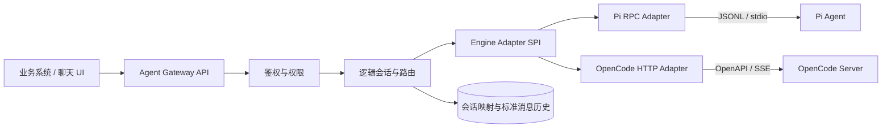

# Switchboard：可替换 Agent 引擎网关

这是一个面向 AI 争霸赛的可运行参考实现：业务系统只调用稳定的 Agent Gateway 接口，网关通过统一 Engine Adapter SPI 接入 **Pi Agent** 与 **OpenCode**。Pi 使用 JSONL/RPC 子进程协议，OpenCode 使用 HTTP/OpenAPI 与 SSE，会话、事件和错误在网关层被统一。

项目内置一个聊天界面，可直观看到引擎切换、逻辑会话、原生 session 绑定及标准化事件流。

## 30 秒启动

要求 Node.js 22 或更高版本，无需安装 npm 依赖。

```bash
npm start
```

打开 <http://localhost:6217/>。默认端口遵循赛题接口规范；`mock` 模式下 Pi 与 OpenCode 都能直接演示，不需要模型密钥。

也可以使用 Docker：

```bash
docker compose up --build
```

本交付件已在 Windows 上验证 OpenCode `1.18.25` 与 Pi `0.84.4`。模型通过请求和环境变量配置，可在调试时使用任意模型、比赛时切换到推荐的 GLM5.2。比赛环境建议固定这两个已验证引擎版本，升级后重新执行协议测试。

## 演示路径

1. 保持 `group-alpha` 和 Pi，发送“记住：本群项目代号是星桥”；
2. 选择 OpenCode，点击“切换当前会话”；
3. 发送“继续刚才的任务”；
4. 观察逻辑会话 ID 不变，同时出现 Pi 与 OpenCode 两个原生 session 绑定；
5. 打开“事件流”，观察两个引擎都输出统一的 `message.delta` 等事件；
6. 更换会话 ID 再提问，证明群会话之间隔离。

命令行自动演示：

```bash
npm run demo
```

运行契约测试：

```bash
npm test
```

## 架构



稳定边界位于 `src/adapters/adapter.js`。新增引擎只需实现：

- `metadata()`：能力和传输信息；
- `healthCheck()`：健康状态；
- `createSession()`：创建原生引擎会话；
- `run()`：将原生流转换成统一事件；
- `closeSession()`：释放会话资源。

网关维护如下关系：

```text
tenantId + conversationId
          -> logicalSessionId
          -> activeEngine
          -> bindings.pi.engineSessionId
          -> bindings.opencode.engineSessionId
          -> normalized history
```

## 网关接口

赛题附件定义的接口已完整实现：`POST /session`、`GET/DELETE /session/:id`、`GET /session/status`、`POST /session/:id/prompt_async`、`GET /session/:id/message`、`POST /session/:id/abort|stop`、问题/权限交互接口以及 `GET /event` 全局 SSE。严格执行方式见 [INSTRUCTION.md](INSTRUCTION.md)。

启动参数及环境变量均可切换引擎：

```powershell
.\gateway.cmd --engine opencode --port 6217 --host localhost
$env:AGENT_ENGINE = "pi"; npm start
```

以下 `/api/*` 是额外的网页演示接口，不影响比赛评测：

| 方法 | 路径 | 作用 |
|---|---|---|
| `GET` | `/health` | 网关健康检查 |
| `GET` | `/api/engines` | 引擎能力与健康状态 |
| `POST` | `/api/chat` | 非流式统一聊天接口 |
| `POST` | `/api/chat/stream` | SSE 流式统一聊天接口 |
| `GET` | `/api/sessions/:conversationId` | 查询会话路由和绑定 |
| `POST` | `/api/sessions/:conversationId/switch` | 切换会话活动引擎 |
| `DELETE` | `/api/sessions/:conversationId` | 关闭并删除会话 |
| `POST` | `/v1/chat/completions` | OpenAI Chat Completions 兼容入口 |

示例：

```bash
curl -X POST http://localhost:6217/api/chat \
  -H "Content-Type: application/json" \
  -d '{"tenantId":"contest","conversationId":"group-a","engine":"pi","input":"你好"}'
```

切换引擎：

```bash
curl -X POST http://localhost:6217/api/sessions/group-a/switch \
  -H "Content-Type: application/json" \
  -d '{"tenantId":"contest","engine":"opencode"}'
```

## 连接真实引擎

复制配置：

```powershell
Copy-Item .env.example .env
```

将 `.env` 中的 `ENGINE_MODE` 改为 `real`。

### 本地 OpenAI 兼容模型（无需修改用户目录）

如果本地模型提供 `/v1/chat/completions`，只需在项目 `.env` 配置：

```dotenv
ENGINE_MODE=real
LOCAL_MODEL_BASE_URL=http://127.0.0.1:8017/v1
LOCAL_MODEL_PROVIDER_ID=local-8017
LOCAL_MODEL_ID=deepseek
LOCAL_MODEL_API_KEY=local
OPENCODE_AUTOSTART=true
OPENCODE_PERMISSION_MODE=allow
```

执行 `npm start` 后，网关会在被 `.gitignore` 排除的 `data/runtime/` 下自动生成 Pi 配置，并通过 `OPENCODE_CONFIG_CONTENT` 给自动启动的 OpenCode Server 注入同一 Provider。无需创建或编辑用户目录下的 `.pi`、`.config/opencode`。`PI_PROVIDER/PI_MODEL` 与 `OPENCODE_PROVIDER_ID/OPENCODE_MODEL_ID` 留空时自动继承统一配置。

普通无人值守对话使用 `OPENCODE_PERMISSION_MODE=allow`，避免工具等待授权导致网关超时；验证权限流程时改为 `ask`，此时包括 `read` 在内的所有工具都会请求授权，可通过 `/permission/{id}/reply` 回复。官方 `prompt_async` 和额外的 `/api/chat` 产生的交互都会登记到 `/permission`、`/question` 队列。

### Pi Agent

根据 [Pi 官方文档](https://pi.dev/docs/latest)，安装命令为：

```bash
npm install -g --ignore-scripts @earendil-works/pi-coding-agent
```

先运行 `pi` 完成模型登录，或配置相应 provider 的 API key。适配器启动：

```text
pi --mode rpc --session-dir <隔离目录> --name <engineSessionId>
```

每个逻辑会话拥有独立子进程和 session 目录；网关重启后，适配器使用 `--continue` 恢复该目录的最新会话。实现严格按 LF 拆分 JSONL，避免把 JSON 字符串里的 Unicode 行分隔符误判为帧边界。

可选配置：`PI_COMMAND`、`PI_PROVIDER`、`PI_MODEL`、`PI_SESSION_ROOT`。

### OpenCode

根据 [OpenCode Server 官方文档](https://opencode.ai/docs/server/)，启动无头服务：

```powershell
$env:OPENCODE_SERVER_PASSWORD = "replace-with-a-strong-password"
opencode serve --hostname 127.0.0.1 --port 4096
```

适配器使用以下原生能力：

- `GET /global/health`：健康检查；
- `POST /session`：创建原生 session；
- `POST /session/:id/message`：执行一轮并获得确定性最终响应；
- `GET /event`：接收文本增量、工具、权限和会话事件；
- `POST /session/:id/abort`：取消运行；
- `DELETE /session/:id`：释放会话。

`.env` 至少配置：

```dotenv
OPENCODE_BASE_URL=http://127.0.0.1:4096
OPENCODE_SERVER_USERNAME=opencode
OPENCODE_SERVER_PASSWORD=replace-with-a-strong-password
OPENCODE_DIRECTORY=.
```

如需覆盖 OpenCode 默认模型，同时设置 `OPENCODE_PROVIDER_ID` 和 `OPENCODE_MODEL_ID`。SSE 是服务级事件流，适配器按 `sessionID` 严格过滤，避免不同群会话的事件串流。同步 `/message` 响应作为流式通道的完成兜底，即使事件流提前结束也能返回最终文本。

> OpenCode 可调用终端和文件工具。真实部署必须启用 Server 密码、限制监听地址，并在 Agent Gateway 再次执行租户、目录和工具权限校验。

## 与赛题接口对接

本项目已按附件 1.1 版规范实现独立比赛协议控制器：

- 赛题请求字段在 `src/competition-api.js` 转为稳定的网关内部模型；
- 网关核心、会话映射和引擎适配器无需修改；
- 赛题响应可由统一事件再次映射成指定格式。

因此接入内部源码时，只需替换或增加一层请求/响应 Mapper，不需要重写 Pi/OpenCode 适配器。

更多材料见：

- [解题思路](docs/solution.md)
- [设计决策记录](docs/design-decisions.md)
- [测试与录屏脚本](docs/demo-and-test.md)
